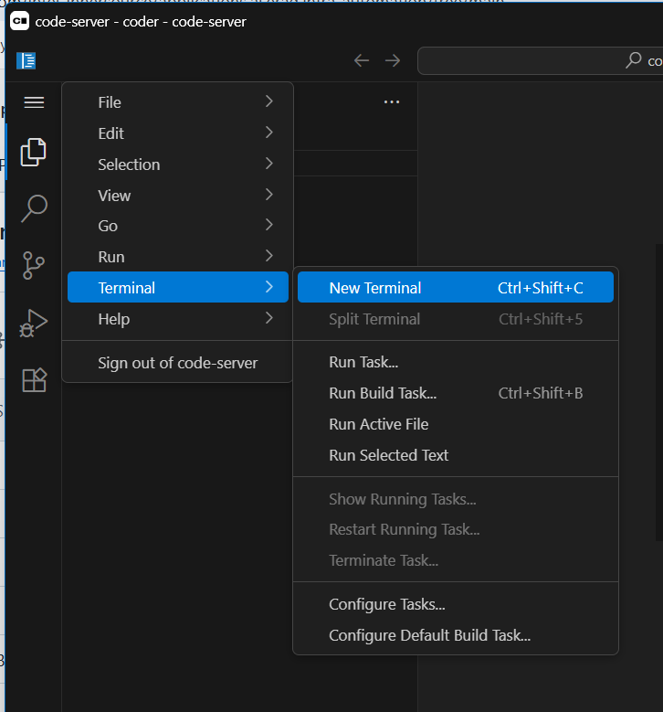
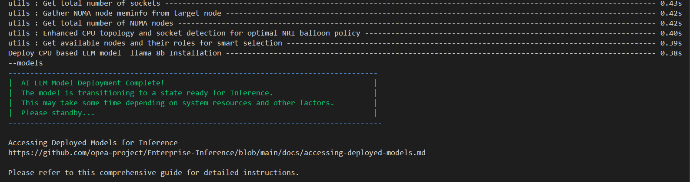
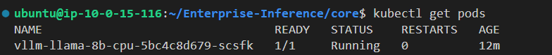
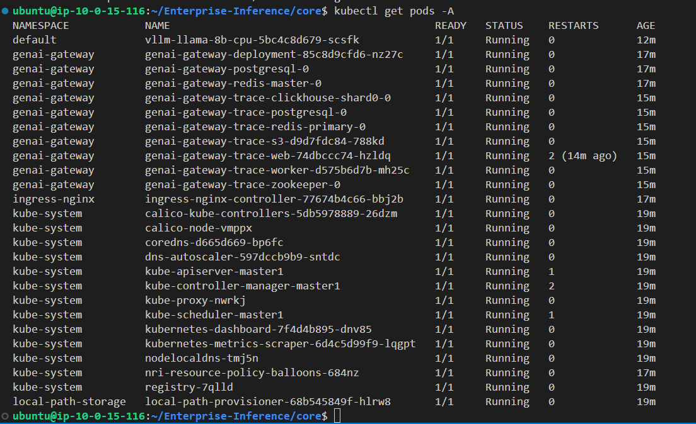
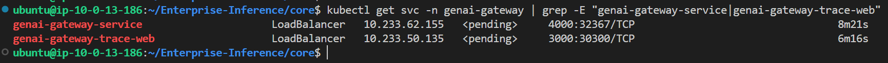
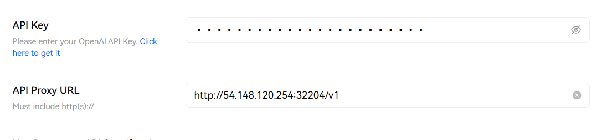

# Single Node Deployment guide

This guide provides step-by-step instructions to deploy Intel® AI for Enterprise Inference on a Single Node.

## Prerequisites
Before running the EI stack automation, we need to have access to Intel Xeon/Gaudi machine.

**NOTE: For todays hands-on excercise we will be providing AWS EC2 instances for participants**

## EC2 instances
**The EC2 instance type `i7ie` is already created and installed with all prerequisites. you don't have to install anything on your local machine**

Let's get started, please go through the instructions carefully

### Step 1: Each user will be provided with EC2 instances.  
The people participating in can share the email id and the EC2 instance will be allocated      
    
**NOTE: Each instance having login page with default password mentinoed in the login page itself**
<!-- ![] -->
## Setting Up the Enterprise Inference stack
Once you login to the machine, open the terminal and proceed with below steps to install the Enterprise Inference stack

### Step 1: Modify the hosts file
Since we are testing locally, we need to map a dummy domain (`api.example.com`) to `localhost` in the `/etc/hosts` file.

Run the following command to edit the hosts file:
```
sudo nano /etc/hosts
```
Add this line at the end:
```
127.0.0.1 api.example.com
```
Save and exit (`CTRL+X`, then `Y` and `Enter`).

### Step 2: Generate a self-signed SSL certificate
Run the following commands to create a self-signed SSL certificate:
```
mkdir -p ~/certs && cd ~/certs
openssl req -x509 -newkey rsa:4096 -keyout key.pem -out cert.pem -days 365 -nodes -subj "/CN=api.example.com"
```
This generates:
- `cert.pem`: The self-signed certificate.
- `key.pem`: The private key.

### Step 3: Configure the Automation config file
Move the single node preset inference config file to the runnig directory

```
cd ~
cd Enterprise-Inference
cp -f docs/examples/single-node/inference-config.cfg core/inference-config.cfg
```

### Step 4: Update `hosts.yaml` File
Move the single node preset hosts config file to the runnig directory

```
cp -f docs/examples/single-node/hosts.yaml core/inventory/hosts.yaml
```

### Step 5: Run the Automation
Now, you can run the automation using your configured file.
```
cd core
chmod +x inference-stack-deploy.sh
```
Export your huggingface token as environment variable. Make sure to replace "Your_Hugging_Face_Token_ID" with your actual Hugging Face Token.

**NOTE:** you should create account in HuggingFace and use the access token from that account
```
export HUGGINGFACE_TOKEN=<<Your_Hugging_Face_Token_ID>>
```

**If your node is CPU only with no gaudi run below to deploy llama 3.1 8b model.**
```
./inference-stack-deploy.sh --models "21" --cpu-or-gpu "cpu" --hugging-face-token $HUGGINGFACE_TOKEN
```
Select option 1 and confirm the Yes/No Pprompt

If your node has Gaudi accelerators run below to deploy llama 3.1 8b model.
```
./inference-stack-deploy.sh --models "1" --cpu-or-gpu "gpu" --hugging-face-token $HUGGINGFACE_TOKEN
```
Select option 1 and confirm the Yes/No prompt

**This will deploy the setup automatically. If you encounter any issues, double-check the prerequisites and configuration files.**

The installation will take few minutes and once deployment is done you should see successfull message as below



After the deployment is complete we can list pods and services to check if all are in running state





NOTE: some pods/services may take time to come up, hence wait till pods are up and Running

### Step 6: Testing the Inference
Once the installation is complete, open another terminal and run the following commands to test the successful deployment of Intel® AI for Enterprise Inference

#### Accessing Models Deployed with GenAI Gateway

To access GenAI Gateway(LiteLLM & Langfuse) run below command 

```
kubectl get svc -n genai-gateway | grep -E "genai-gateway-service|genai-gateway-trace-web"
```

notedown the ports highlighted in the image below which we got from above command


#### check if Models Endpoint is working correctly
```bash
curl --location 'https://<ip_address>:<genai-gateway-service-port>/v1/chat/completions' \
--header 'Content-Type: application/json' \
--header 'Authorization: Bearer <<master-key>>' \
--data '{
    "model": "meta-llama/Llama-3.1-8B-Instruct",
    "messages": [
        {
            "role": "user",
            "content": "Hello!"
        }
    ]
}'
```

#### Logging in to GenAI Gateway(LiteLLM)
LiteLLM unifies and routes requests to multiple LLM providers under one OpenAI-style API, while Langfuse adds observability — tracing, analytics, and debugging — so you can monitor and improve every LLM interaction from that unified endpoint.

Lets explore LiteLLM and Langfuse

Username and passwords will be saved in yaml file, hence you can open new terminal and run below command to refer to user and passwords for LiteLLM and Langfuse portal login

`cat core/inventory/metadata/vault.yml`

once we get username and passwords, use below URL with system IP and correspoding port to view dashboard

`http://<ip_address>:<genai-gateway-service-port>`

Username: admin

litellm_master_key corresponds to litellm password in vault.yml file

##### Logging in to GenAI Gateway Trace(Langfuse)

`http://<ip_address>:<genai-gateway-trace-web-port>`

Username: "admin@admin.com"

langfuse_password corresponds to langfuse password in vault.yml file

**(Optional)**  
**To test on CPU Inference with lobehub client follow below steps:**

open below url in browser       
https://chat-preview.lobehub.com/settings?active=provider&tab=chat&provider=openai         
API proxy URL - `http://<ip_address>:<genai-gateway-service-port>`            
API Key - your Litellm key/master




